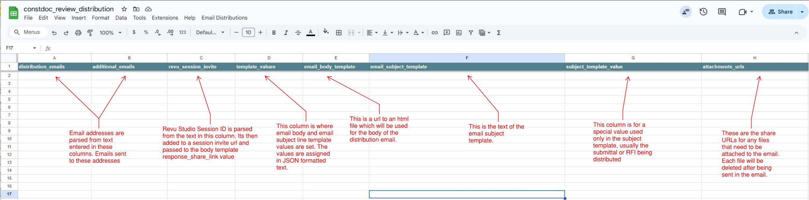

# UCSC Construction Documents – Email Distribution System

This system automates sending emails with document attachments and Bluebeam Studio session invites. The underlying Apps Script reads distribution data from a Google Spreadsheet and processes each row to send emails using Gmail. This document explains how to correctly fill in your spreadsheet and provides essential details for troubleshooting.

---

## Spreadsheet Structure

Your spreadsheet should include the following columns. Ensure that column header names exactly match these names so the script can correctly map data.



### Required Columns

- **distribution_emails**  
  Primary email addresses (comma-separated) for distribution lists.  
  _Example:_ `user1@example.com, user2@example.com`

- **additional_emails**  
  Additional individual email addresses to include.  
  _Example:_ `extra1@example.com; extra2@example.com`

- **email_body_template**  
  URL of the Google Drive HTML file used as the email body template.  
  _Note:_ The file ID will be extracted from this URL.

- **attachments_urls**  
  Comma or semicolon-separated list of Google Drive file URLs to attach to the email.  
  _Tip:_ After emailing, attachments are trashed, so double-check that the files are not needed later.

- **email_subject_template**  
  URL of a Google Drive file containing the email subject template.  
  This is the only column used for the email subject. It can contain dynamic templating variables. If no templating variables are present, the file's content will be used as the subject.  
  _Fallback:_ If left empty, the system uses a default subject: specified in configuration.

- **subject_template_value**  
  (Optional) A field to supply extra values for the subject template. HTML entities in this field will be decoded before processing.

- **template_values**  
  A JSON string that contains key/value pairs for dynamic content replacements when processing the email body template.  
  _Example:_  
  ```json
  {"projectName": "New Building", "deadline": "2023-11-15"}
  ```

- **template_label**  
  (Optional) A label that identifies a predefined template in the `distribution_templates` sheet. When specified, any empty fields in the row will be automatically populated with values from the matching template.

### Optional Columns

- **revu_session_invite**  
  Contains Bluebeam Revu session invite details. The script parses this column to extract a session ID (expected in the format `123-456-789`). If a valid session ID is found, it will be passed to the email template.  
  _Tip:_ Ensure the session invite text contains a valid session ID, as the first matching sequence in the invite text is used.
---

## Configuration and Sheet Setup

The script's configuration is defined in Code.ts (and subsequently in Code.gs) via a global CONFIG object with properties such as:
- FROM_EMAIL: The sender's email address.
- DEFAULT_SUBJECT: Fallback subject if no template is provided.
- SPREADSHEET_ID: The ID of the Google Spreadsheet containing distribution data.
- DEBUG_MODE: Enables detailed logging for troubleshooting.

The script automatically maps spreadsheet columns to expected keys. Ensure your spreadsheet includes columns with these exact header names:
- distribution_emails
- additional_emails
- email_body_template
- attachments_urls
- email_subject_template
- subject_template_value
- template_values
- revu_session_invite
- template_label

## How the Script Works

1. **Row Processing**  
   The script processes rows in reverse order. Each row is validated for:
   - At least one non-empty value in `distribution_emails` or `additional_emails`
   - A valid URL in `email_body_template`

2. **Template Processing**  
   - The **email body** is generated by fetching the specified HTML template from Google Drive, merging it with values obtained from the JSON `template_values` column as well as any additional columns.
   - The **email subject** is generated solely from the `email_subject_template` column. Dynamic templating is supported; if no variables are provided, the content of the file is used directly. Otherwise, a default subject (configured in the system) is used as a fallback.
   - If a **template_label** is specified, the system will first check for a matching template in the `distribution_templates` sheet and apply any default values before processing the email.

3. **Email Sending and Attachments Management**  
   - Email is sent via Gmail using the specified sender email (set in configuration).  
   - Upon successful sending, the script will automatically trash all files specified in the `attachments_urls` column. This helps ensure obsolete files aren't left on Drive.
   - **Attachment Size Limit:** Each attached file must be under 21 MB. If any file exceeds this limit, the script logs an error and throws an exception. As a result, the email will not be sent until the issue is resolved.

4. **History Tracking**  
   Once an email is successfully sent, the corresponding row is moved to a history sheet (`sent_history`) along with a timestamp.

---

## Using Distribution Templates

The system supports reusable templates that can be defined once and applied to multiple email distributions:

1. **Defining Templates:**  
   - Templates are stored in a sheet named `distribution_templates`
   - Each template row has the same columns as the `distributions_to_send` sheet
   - The `template_label` column serves as a unique identifier for the template

2. **Using Templates:**  
   - In the `distributions_to_send` sheet, set the `template_label` column to the label of your desired template
   - When processing, the system will automatically fill in any empty fields with values from the template
   - Fields that already have values in the row will not be overwritten by template values
   - If a specified template doesn't exist, the system will throw an error and skip that row

3. **Applying Templates Manually:**  
   - You can use the "Apply Templates to Pending Rows" option from the menu to apply templates without sending emails
   - This is useful for previewing how templates will be applied before actually sending the emails

4. **Template Priority:**  
   - Row values > Template values > Default values
   - Existing values in a row are never overwritten by template values

---

## Tips for End Users

- **Template Values JSON:** Always ensure that the JSON in the `template_values` column is valid. Use proper quotes and avoid extra escape characters.  
- **File URLs:** Only valid Google Drive URLs will work. Make sure each URL points to the correct file, and note that files passed to attachments_urls will be trashed after processing.  
- **Bluebeam Session Invites:** If using Bluebeam invites, include a valid session ID (e.g., `123-456-789`) within the `revu_session_invite` text so it is automatically extracted.
- **Creating Templates:** For commonly used email configurations, create a template in the `distribution_templates` sheet with a descriptive label, then reference it by that label in your individual email rows.

---

## Getting Started

1. **Initialize the Spreadsheet Structure:**  
   - Use the "Initialize Spreadsheet Structure" option from the menu to set up required sheets and columns.
   - This will create the `distributions_to_send`, `sent_history`, and `distribution_templates` sheets if they don't exist.

2. **Configure Templates:**  
   - Add template rows to the `distribution_templates` sheet with appropriate `template_label` values.
   - Fill in default values for each template.

3. **Create Email Distributions:**  
   - Add rows to the `distributions_to_send` sheet.
   - Set the `template_label` to use a predefined template, or leave it blank to specify all values manually.
   - Fill in any values that should override template defaults.
   - Update your email templates on Google Drive with placeholders matching the keys from `template_values` or any additional column.

4. **Deploy the Script:**  
   - Open the Apps Script editor in the spreadsheet.
   - Deploy the script ensuring you grant all necessary permissions (Spreadsheet, Drive, Gmail).
  
5. **Run the Distribution:**  
   - You can manually run the `processEmailDistributions` function from the Apps Script console or use the custom menu added to the spreadsheet.
   - After opening the spreadsheet, select **Email Distributions > Send Pending Emails** from the custom menu to trigger the email sending process.

---

## Troubleshooting

- **Invalid File URLs:** Verify that URLs in `email_body_template` and `attachments_urls` are valid and accessible.
- **JSON Parsing Errors:** Check that the JSON in `template_values` is correctly formatted.
- **Permissions Issues:** Ensure that the account running the script has sufficient access to read the files and that file sharing settings allow processing.
- **Bluebeam Session Not Extracted:** Confirm that the `revu_session_invite` contains a valid session ID in the expected format.
- **Template Not Found:** If you receive a "Template not found" error, check that the `template_label` value exactly matches a template in the `distribution_templates` sheet.

---

## Appendix 1: Using Template Values in Email Templates

The `template_values` column lets you provide key/value pairs in JSON format to dynamically fill placeholders in your email body and subject templates. Think of it like setting variables in a simple arithmetic problem:

- In arithmetic, you might say "let x = 2" and then compute "x + 3" to get 5.
- Comparably, in your email templates you define variables via JSON. For instance, in your spreadsheet's "template_values" column you can supply:
  
  {
    "x": "2",
    "project_name": "New Building"
  }
  
Then, in your HTML template you use the variable like so:
  
  `<p>Project: <?= project_name ?></p>`
  
Both approaches ultimately provide dynamic values for further processing.

### Tips for formatting your JSON:
- Always use proper double quotes around keys and values.
- Avoid using extra characters or missing punctuation (for example, commas between pairs).
- A correct example:
  ```json
  {"projectName": "New Building", "deadline": "2023-11-15"}
  ```
- An incorrect example:
  ```
  {projectName: New Building, deadline: '2023-11-15'}
  ```

This mechanism works just as replacing a variable in an arithmetic equation: once you set the variable, you use it to compute your final value (in this case, the email subject or body).

## Appendix 2: Creating HTML Email Templates with Apps Script

The Apps Script HTML templating engine lets you design dynamic email templates. Think of it like filling in the blanks on a worksheet:
- Create a new HTML file (e.g., "email_template.html") stored in Google Drive.
- Design your email layout using standard HTML and CSS.
- Insert dynamic placeholders using syntax like <?= projectName ?>. For example, if you include:
  <?= projectName ?>
  the script replaces it with the value provided in your JSON (e.g., "New Building").
- In your spreadsheet, set the `email_body_template` (or `email_subject_template`) column to the URL of your HTML file.
- Ensure that the corresponding `template_values` JSON contains keys matching your placeholders.

Happy Document Distribution!
